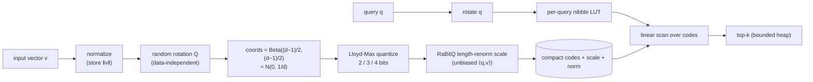

<div align="center">

# quantvec

**Data-oblivious, zero-training vector quantization & nearest-neighbor search for TypeScript.**

A clean-room implementation of Google Research's [TurboQuant](https://arxiv.org/abs/2504.19874)
(Zandieh, Daliri, Hadian, Mirrokni — 2025), with the
[RaBitQ](https://arxiv.org/abs/2405.12497) (Gao & Long, SIGMOD 2024) unbiased-estimator correction.
Runs anywhere JavaScript runs — Node, browsers, Bun, Cloudflare Workers, React Native.

[](https://www.npmjs.com/package/quantvec)
[](./LICENSE)

**Add vectors, search instantly — no training, no native build, no server.** 7.9–15.7× smaller than
float32, runs in Node, the browser, Bun, and edge runtimes, with a WASM kernel and a pure-TS fallback.

</div>

## Why quantvec

Most vector quantizers need a **training phase** (k-means codebooks, learned rotations) — awkward
when you can't ship a trained model or run k-means in-process. TurboQuant is **data-oblivious**: a
random rotation makes every coordinate follow a known Beta distribution, so an optimal per-coordinate
scalar quantizer works with **no training and ~zero indexing time** (paper Table 2). That makes
quantvec a natural fit for **edge, serverless, and browser** vector search.

- **Zero training, instant ingest** — add vectors, search immediately. No fit step, no codebook to ship.
- **Isomorphic** — one package for Node, browsers, Bun, Workers, React Native. Standard ESM/CJS + types,
  zero runtime dependencies, no `node:*` in the core.
- **Runtime-selectable metrics** — `cosine`, `dot`, or `euclidean` per query (norms are stored).
- **Flexible ids** — `number` (default), `string`, or `bigint`.
- **Hardened persistence** — one versioned binary format; the load path validates every field of
  untrusted input before allocating.

> **Scope:** quantvec is a _flat quantized index_ — search is a linear scan over compact codes (à la
> FAISS `IndexPQFastScan`), not an HNSW graph. Great recall and throughput up to ~1–10M vectors; a
> coarse-quantizer/IVF layer for larger corpora is on the roadmap.

## Install

```bash
npm install quantvec   # or: bun add quantvec / pnpm add quantvec
```

## Quick start

```ts
import { TurboQuantIndex } from 'quantvec';

// No training: the rotation + codebook are fixed by (dim, bits, seed).
const index = new TurboQuantIndex({ dim: 1536, bits: 4, metric: 'cosine' });

index.add(vectors); // a flat Float32Array (m·dim), or number[][] / Float32Array[]

const { indices, scores } = index.search(query, 10); // 10 nearest, best-first
// indices: Int32Array of slot positions · scores: Float32Array of similarities
```

### Stable ids with `IdMapIndex`

A thin, stable-id layer over the positional index — add, search, and remove by _your_ id:

```ts
import { IdMapIndex } from 'quantvec';

const db = new IdMapIndex<string>({ dim: 768, bits: 4 });
db.addWithIds(['doc-1', 'doc-2', 'doc-3'], vectors);

const { ids, scores } = db.search(query, 5); // ids: string[] best-first
db.has('doc-2'); // → true
db.remove('doc-2'); // O(1)

// Optional allowlist predicate:
db.search(query, 5, { filter: (id) => id !== 'doc-1' });
```

`number` is the default id type; `string` and `bigint` are opt-in via the generic parameter.

### Persistence (isomorphic)

```ts
const bytes = index.toBytes(); // Uint8Array — store anywhere
const restored = TurboQuantIndex.fromBytes(bytes);
// IdMapIndex.fromBytes<string>(bytes) for the id-keyed index.
```

In the browser put `bytes` in IndexedDB or `fetch` it; in Node use the `quantvec/node` subpath:

```ts
import { saveIndex, loadIndex, loadIdMapIndex } from 'quantvec/node';

await saveIndex(index, './index.qv');
const idx = await loadIndex('./index.qv');
```

### Typed errors

Every boundary throws a discriminated, code-tagged error you can switch on:

```ts
import { TurboQuantIndex, IndexError } from 'quantvec';

try {
  new TurboQuantIndex({ dim: 1536 }).search(query, 10); // empty index
} catch (e) {
  if (e instanceof IndexError && e.code === 'EMPTY') {
    /* ... */
  }
}
```

`IndexError`, `IdMapError`, `DeserializeError`, `EncodeError`, and `SearchError` are all exported.

## How it works



1. **Normalize** each vector (store its norm for metric reconstruction).
2. **Random rotation** (data-independent) → each coordinate ≈ Beta((d−1)/2, (d−1)/2) ≈ N(0, 1/d).
3. **Lloyd-Max scalar quantization** — the MSE-optimal codebook for that _known_ distribution
   (no data needed), within ≈2.7× of the information-theoretic bound (paper Theorem 3).
4. **RaBitQ length-renormalization scale** per vector → an unbiased inner-product estimate at query time.
5. **Search** rotates the query once, builds a per-query lookup table, and scans the codes.

See [`docs/research/`](./docs/research/) for distilled paper notes and the full architecture.

## Benchmarks

**Real dataset — SIFT-small** (10k × 128-d, 100 queries, 100-NN L2 ground truth; `npm run bench:real`).
Recall is measured against the dataset's own ground truth; dim=128 (a power of two) exercises the FWHT
rotation + WASM kernel:

| bits | recall@1 | recall@10 | recall@100 | encode (vec/s) | QPS   | compression |
| ---- | -------- | --------- | ---------- | -------------- | ----- | ----------- |
| 2    | 0.62     | 0.67      | 0.74       | ~255k          | ~990  | 12.8×       |
| 3    | 0.72     | 0.80      | 0.86       | ~191k          | ~1040 | 9.1×        |
| 4    | 0.86     | 0.89      | 0.93       | ~171k          | ~1080 | 7.1×        |

**Synthetic** (seeded, dataset-free; `bun run benchmarks/flat.ts`) — `dim=1536, cosine`, recall vs exact
float32: recall@10 0.64 / 0.80 / 0.89 at 2 / 3 / 4 bits with **15.7× / 10.5× / 7.9×** serialized
compression (true bit-packing — on par with native TurboQuant, ~15.8× @ 2-bit / ~8.0× @ 4-bit).

Details and JSON in [`benchmarks/`](./benchmarks/). The bigger v128-FastScan kernel (further query
speedup) is on the [roadmap](#roadmap).

## Roadmap

| Status | Item                                                                                                                                                                 |
| ------ | -------------------------------------------------------------------------------------------------------------------------------------------------------------------- |
| ✅     | Core math (rotation, Beta/Lloyd-Max codebooks), encode pipeline, flat nibble-LUT search                                                                              |
| ✅     | `TurboQuantIndex`, `IdMapIndex`, versioned serialization, Node fs helpers                                                                                            |
| ✅     | True 2/3/4-bit **bit-packed serialization** (7.9–15.7× compression)                                                                                                  |
| ✅     | **FWHT rotation** for power-of-two dims (exact, O(d·log d) build/encode, ~25× faster encode, recall-neutral)                                                         |
| ✅     | **TQ+ per-coordinate calibration** (opt-in; data-dependent — helps real embeddings, neutral on synthetic)                                                            |
| ✅     | **WASM scoring kernel** (AssemblyScript, resident codes, exact f64 — bit-identical to the scalar oracle, ~1.3× faster query; auto feature-detect + pure-TS fallback) |
| 🚧     | v128 FastScan (blocked-nibble swizzle + u8 LUT + rescore) for a larger query speedup                                                                                 |
| 🚧     | qdrant-style ergonomic layer: `createCollection`, `Point`, payloads, filter DSL                                                                                      |
| 📋     | Real-dataset benchmark suite (GloVe / DBpedia / OpenAI)                                                                                                              |
| 📋     | IVF / coarse-quantizer for 10M+ corpora                                                                                                                              |

Tracked in [`docs/worklog/PROGRESS.md`](./docs/worklog/PROGRESS.md), built with a doer / verifier /
devil's-advocate subagent workflow.

## References

- **TurboQuant: Online Vector Quantization with Near-optimal Distortion Rate** — Zandieh, Daliri,
  Hadian, Mirrokni. [arXiv:2504.19874](https://arxiv.org/abs/2504.19874).
- **RaBitQ: Quantizing High-Dimensional Vectors with a Theoretical Error Bound for Approximate Nearest
  Neighbor Search** — Gao & Long, SIGMOD 2024. [arXiv:2405.12497](https://arxiv.org/abs/2405.12497).

## License

[Apache-2.0](./LICENSE) © Ahmed Tokyo. See [`NOTICE`](./NOTICE). quantvec is an independent clean-room
implementation and is not affiliated with or endorsed by Google.
