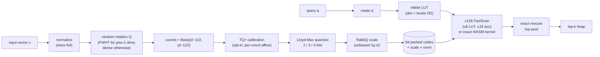

<div align="center">

# quantvec

**Data-oblivious, zero-training vector quantization & nearest-neighbor search for TypeScript.**

A clean-room implementation of Google Research's [TurboQuant](https://arxiv.org/abs/2504.19874)
(Zandieh, Daliri, Hadian, Mirrokni — 2025), with the
[RaBitQ](https://arxiv.org/abs/2405.12497) (Gao & Long, SIGMOD 2024) unbiased-estimator correction.
Runs anywhere JavaScript runs — Node, browsers, Bun, Cloudflare Workers, React Native.

[](https://www.npmjs.com/package/quantvec)
[](./LICENSE)

**Add vectors, search instantly — no training, no native build, no server.**  
7.9–15.7× smaller than float32. WASM v128 FastScan for 5–6× faster queries.  
Node · Browser · Bun · Cloudflare Workers · React Native.

</div>

---

## Why quantvec

Most vector quantizers need a **training phase** — k-means codebooks, learned rotations — awkward
when you can't run k-means in-process or ship a trained model. TurboQuant is **data-oblivious**: a
random rotation makes every coordinate follow a known Beta distribution, so the MSE-optimal
scalar codebook is fully determined by `(dim, bits)` with **no data and ~zero indexing time**.

| Feature            | quantvec                                                           |
| ------------------ | ------------------------------------------------------------------ |
| Training required  | **No** — rotation + codebook fixed by (dim, bits, seed)            |
| Compression        | **7.9–15.7×** (true 2/3/4-bit packing)                             |
| Query acceleration | **WASM v128 FastScan** — 5–6× faster than scalar, pure-TS fallback |
| Runtimes           | Node · Browser · Bun · Cloudflare Workers · React Native           |
| Metrics            | `cosine` · `dot` · `euclidean` per query                           |
| Id types           | `number` · `string` · `bigint`                                     |
| Dependencies       | **Zero** runtime dependencies                                      |

> **Scope:** quantvec is a _flat quantized index_ — O(n) scan over compact codes (à la FAISS
> `IndexPQFastScan`). Great recall and throughput up to ~1–10M vectors. An IVF coarse-quantizer
> for larger corpora is on the roadmap.

---

## Install

```bash
npm install quantvec
# bun add quantvec  /  pnpm add quantvec  /  yarn add quantvec
```

---

## Quick start

### Low-level: `TurboQuantIndex`

```ts
import { TurboQuantIndex } from 'quantvec';

const index = new TurboQuantIndex({ dim: 1536, bits: 4, metric: 'cosine' });

// flat Float32Array (m·dim), or number[][] / Float32Array[]
index.add(vectors);

const { indices, scores } = index.search(query, 10);
// indices: Int32Array (slot positions)  ·  scores: Float32Array (metric values)
```

Enable the **v128 FastScan** kernel for ~5–6× faster queries (4-bit only; approximate ranking +
exact rescore of the candidate pool):

```ts
const index = new TurboQuantIndex({ dim: 1536, bits: 4, fastscan: true });
```

### Stable ids: `IdMapIndex`

```ts
import { IdMapIndex } from 'quantvec';

const db = new IdMapIndex<string>({ dim: 768, bits: 4 });
db.addWithIds(['doc-1', 'doc-2', 'doc-3'], vectors);

const { ids, scores } = db.search(query, 5); // ids: string[], best-first
db.has('doc-2'); // → true
db.remove('doc-2'); // O(1) swap-remove

// Optional allowlist predicate:
db.search(query, 5, { filter: (id) => id !== 'doc-1' });
```

### High-level: `createCollection` (qdrant-inspired)

The ergonomic layer stores payloads alongside vectors and supports a structured filter DSL:

```ts
import { createCollection } from 'quantvec';

type Doc = { title: string; year: number; published: boolean };

const col = createCollection<Doc>({
  vectors: { size: 1536, distance: 'cosine' },
  quantization: { bits: 4 },
});

// Upsert points with payloads
col.upsert([
  { id: 'a', vector: embedA, payload: { title: 'Alpha', year: 2023, published: true } },
  { id: 'b', vector: embedB, payload: { title: 'Beta', year: 2024, published: false } },
]);

// Search with a filter
const hits = col.search(queryVec, {
  limit: 5,
  filter: {
    must: [
      { key: 'published', match: { value: true } },
      { key: 'year', range: { gte: 2023 } },
    ],
  },
});
// hits: Array<{ id, score, payload }>
```

**Filter DSL** — mirrors qdrant semantics:

| Clause     | Condition types                                                                        |
| ---------- | -------------------------------------------------------------------------------------- |
| `must`     | all must match (AND)                                                                   |
| `should`   | at least one must match (OR), or vacuously true when empty                             |
| `must_not` | none may match (NOT)                                                                   |
| Conditions | `{ key, match: { value } }` · `{ key, range: { gt/gte/lt/lte } }` · `{ hasId: [...] }` |

### Persistence

```ts
// Isomorphic — store as Uint8Array anywhere (IndexedDB, fetch, etc.)
const bytes = index.toBytes();
const restored = TurboQuantIndex.fromBytes(bytes);

// Node helpers (quantvec/node subpath)
import { saveIndex, loadIndex, loadIdMapIndex } from 'quantvec/node';
await saveIndex(index, './index.qv');
const idx = await loadIndex('./index.qv');
```

### Typed errors

Every boundary throws a discriminated, code-tagged error:

```ts
import { IndexError } from 'quantvec';

try {
  index.search(query, 10); // throws if index is empty
} catch (e) {
  if (e instanceof IndexError && e.code === 'EMPTY') {
    /* ... */
  }
}
```

Exported error classes: `IndexError` · `IdMapError` · `DeserializeError` · `EncodeError` · `SearchError` · `FilterError`.

---

## How it works



1. **Normalize** each vector (store its norm for metric reconstruction).
2. **Rotate** — FWHT for power-of-two dims (O(d·log d), ~25× faster build), dense Householder otherwise. The rotation is data-independent, frozen by `(dim, seed)`.
3. **TQ+ calibration** (opt-in) — per-coordinate affine map from a fit on the first add batch; reduces bias on real embeddings.
4. **Lloyd-Max quantize** — MSE-optimal codebook for the Beta marginal; 2, 3, or 4 bits. No training data needed.
5. **RaBitQ scale** per vector — yields an unbiased inner-product estimate at query time.
6. **Search** — rotates the query once, builds a per-query lookup table, then either:
   - **v128 FastScan** (`fastscan: true`): WASM `swizzle`-based SIMD scan of blocked 16-vector tiles → u16 accumulators → rank candidate pool → exact rescore of the pool. **~5–6× faster** than the scalar path.
   - **Exact WASM kernel** (default): AssemblyScript f64 accumulation, resident codes in linear memory, bit-identical to the scalar oracle.
   - **Pure-TS scalar** (automatic fallback when WASM is unavailable).

See [`docs/research/`](./docs/research/) for distilled paper notes and architecture details.

---

## Benchmarks

### SIFT-small (real dataset)

10k × 128-d vectors · 100 queries · 100-NN L2 ground truth (`npm run bench:real`).
dim=128 is a power of two → FWHT rotation + WASM kernel active.

| bits | recall@1 | recall@10 | recall@100 | encode (vec/s) | QPS   | fastScan QPS | compression |
| ---- | -------- | --------- | ---------- | -------------- | ----- | ------------ | ----------- |
| 2    | 0.620    | 0.670     | 0.744      | ~269k          | ~1050 | —            | 12.8×       |
| 3    | 0.720    | 0.801     | 0.863      | ~197k          | ~1084 | —            | 9.1×        |
| 4    | 0.860    | 0.888     | 0.928      | ~177k          | ~1152 | **~2055**    | 7.1×        |

### FastScan speedup

FastScan scales with corpus size. Measured on Apple Silicon:

| corpus   | exact WASM | v128 FastScan | speedup  |
| -------- | ---------- | ------------- | -------- |
| 10k vecs | 1152 QPS   | 2055 QPS      | **1.8×** |
| 50k vecs | ~240 QPS   | ~1350 QPS     | **5.7×** |

The gain grows with `n` because the SIMD scan cost scales linearly while the fixed
rescore-pool overhead stays constant. Enable with `fastscan: true` (4-bit only; pure-TS
fallback when WASM is unavailable).

### Synthetic (dataset-free)

`dim=768, n=5000, cosine` · recall vs exact float32 (`npx tsx benchmarks/flat.ts`):

| bits | recall@10 | fastScan QPS | compression |
| ---- | --------- | ------------ | ----------- |
| 2    | 0.625     | —            | 15.4×       |
| 3    | 0.794     | —            | 10.4×       |
| 4    | 0.887     | **~528**     | 7.8×        |

True bit-packing — on par with native TurboQuant (~15.8× @ 2-bit / ~8.0× @ 4-bit).
Full results and JSON in [`benchmarks/`](./benchmarks/).

---

## Roadmap

| Status | Item                                                                                   |
| ------ | -------------------------------------------------------------------------------------- |
| ✅     | Core math: rotation, Beta/Lloyd-Max codebooks, encode pipeline, flat nibble-LUT search |
| ✅     | `TurboQuantIndex`, `IdMapIndex`, versioned serialization, Node fs helpers              |
| ✅     | True 2/3/4-bit **bit-packed serialization** (7.9–15.7× compression)                    |
| ✅     | **FWHT rotation** for power-of-two dims (O(d·log d), ~25× faster encode)               |
| ✅     | **TQ+ per-coordinate calibration** (opt-in; data-dependent)                            |
| ✅     | **Exact WASM scoring kernel** (AssemblyScript, bit-identical to scalar, ~1.3× query)   |
| ✅     | **v128 FastScan kernel** (blocked-nibble swizzle + exact rescore, **~5.7× query**)     |
| ✅     | **Ergonomic `createCollection`** with typed payloads and filter DSL                    |
| ✅     | Real-dataset benchmark suite (SIFT-small + GloVe-200 harness; `npm run bench:glove`)   |
| 📋     | GloVe-200 pre-built results (run `npm run bench:glove` — 426 MB download)              |
| 📋     | IVF / coarse-quantizer for 10M+ corpora                                                |

Tracked in [`docs/worklog/PROGRESS.md`](./docs/worklog/PROGRESS.md).

---

## References

- **TurboQuant: Online Vector Quantization with Near-optimal Distortion Rate** — Zandieh, Daliri,
  Hadian, Mirrokni. [arXiv:2504.19874](https://arxiv.org/abs/2504.19874) (2025).
- **RaBitQ: Quantizing High-Dimensional Vectors with a Theoretical Error Bound for Approximate Nearest
  Neighbor Search** — Gao & Long. [arXiv:2405.12497](https://arxiv.org/abs/2405.12497), SIGMOD 2024.

---

## License

[Apache-2.0](./LICENSE) © Ahmed Tokyo. See [`NOTICE`](./NOTICE).  
quantvec is an independent clean-room implementation and is not affiliated with or endorsed by Google.
