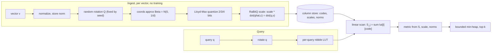

# Architecture

quantvec is a clean-room implementation of [TurboQuant](https://arxiv.org/abs/2504.19874) with the
[RaBitQ](https://arxiv.org/abs/2405.12497) unbiased-estimator correction. This page traces a vector
from ingest to a ranked result.

## The encode → search pipeline

## Why no training

After an orthonormal random rotation, a unit vector is uniform on the sphere, so **each coordinate
follows a known Beta distribution** ≈ N(0, 1/d), independent of your data. The MSE-optimal scalar
quantizer for that fixed distribution (Lloyd-Max) can therefore be **precomputed numerically** — no
k-means, no codebook to ship, ~zero indexing time. quantvec builds the rotation (Householder QR of a
seeded Gaussian matrix) and the per-bit codebooks once in the constructor.

## Unbiased inner products (RaBitQ)

MSE-optimal quantization is biased for dot products. quantvec stores a per-vector
**length-renormalization scale** so that `scale · ⟨q̂, c⟩` is an unbiased estimate of `⟨q, v⟩`, with
variance that shrinks as `d` grows. Stored norms let the same codes serve cosine, dot, and squared
euclidean at query time.

## Search path

`search` rotates the query once, builds a per-query lookup table (`lut[i][code] = q̂ᵢ · centroidₐ`),
then scans every (unmasked) row accumulating `Sⱼ = Σᵢ lut[i][codeⱼᵢ]`. Each `Sⱼ` is turned into the
requested metric using the per-vector `scale`/`norm` and the query norm, and the best `k` are kept in
a bounded min-heap. This pure-TypeScript scalar kernel is the **correctness oracle**. A WASM kernel
(`assembly/index.ts`, loaded via `src/wasm/kernel.ts`) accelerates this scan: the
index's codes live resident in wasm linear memory (uploaded once per mutation), and
the kernel accumulates `Sⱼ` in f64 over the same order, so its results are
**bit-identical** to the scalar oracle — an exact speedup, with automatic
feature-detection and a pure-TS fallback when WebAssembly is unavailable.

## Module map

| Module | Responsibility |
| ------ | -------------- |
| `core/rng`, `core/rotation`, `core/fwht` | seeded RNG, rotation (Householder QR, or FWHT for power-of-two dims) |
| `core/beta`, `core/codebook` | Beta pdf/cdf/quantile, Lloyd-Max codebooks per `(dim, bits)` |
| `core/encode`, `core/pack`, `core/calibrate` | normalize→rotate→(TQ+)→quantize→scale; bit-pack; calibration fit |
| `core/search`, `core/topk`, `core/metrics` | nibble-LUT scan, bounded heap, distance math |
| `wasm/kernel` + `assembly/` | WASM scoring kernel (exact f64) with feature-detect + fallback |
| `index/turboquant-index` | growable positional flat index |
| `index/id-map-index` | stable id↔slot layer |
| `io/serialize` | versioned `QVEC` (de)serialization (see [Serialization Format](/docs/serialization)) |

## Scope

quantvec is a **flat** quantized index — search is an O(n) scan, excellent to ~1–10M vectors. It is
not an HNSW graph; an IVF/coarse-quantizer layer for larger corpora is on the [roadmap](/docs/roadmap).
