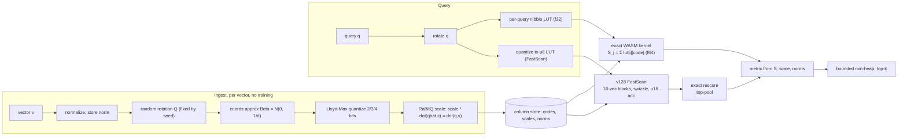

# Architecture

quantvec is a clean-room implementation of [TurboQuant](https://arxiv.org/abs/2504.19874) with the
[RaBitQ](https://arxiv.org/abs/2405.12497) unbiased-estimator correction. This page traces a vector
from ingest to a ranked result.

## The encode → search pipeline

## Why no training

After an orthonormal random rotation, a unit vector is uniform on the sphere, so **each coordinate
follows a known Beta distribution** ≈ N(0, 1/d), independent of your data. The MSE-optimal scalar
quantizer for that fixed distribution (Lloyd-Max) can therefore be **precomputed numerically** — no
k-means, no codebook to ship, ~zero indexing time. quantvec builds the rotation (Householder QR of a
seeded Gaussian matrix) and the per-bit codebooks once in the constructor.

## Unbiased inner products (RaBitQ)

MSE-optimal quantization is biased for dot products. quantvec stores a per-vector
**length-renormalization scale** so that `scale · ⟨q̂, c⟩` is an unbiased estimate of `⟨q, v⟩`, with
variance that shrinks as `d` grows. Stored norms let the same codes serve cosine, dot, and squared
euclidean at query time.

## Search path

`search` rotates the query once, builds a per-query lookup table (`lut[i][code] = q̂ᵢ · centroidₐ`),
then scans every (unmasked) row accumulating `Sⱼ = Σᵢ lut[i][codeⱼᵢ]`. Each `Sⱼ` is turned into the
requested metric using the per-vector `scale`/`norm` and the query norm, and the best `k` are kept in
a bounded min-heap. This pure-TypeScript scalar kernel is the **correctness oracle**. Two WASM accelerations are available:

- **Exact WASM kernel** (default, `wasm: true`): codes resident in wasm linear memory (uploaded once per mutation); f64 accumulation in the same order as the scalar oracle → **bit-identical** results, ~1.3× faster query. Auto feature-detect + pure-TS fallback.
- **v128 FastScan** (`fastscan: true`, 4-bit only): codes in a 16-vector blocked layout; per-query u8 LUT built with a global affine map; `v128.swizzle` performs 16 simultaneous table lookups per coordinate; u16 accumulators rank a candidate pool (≥ max(4k, k+64)); the pool is rescored exactly. **~1.8–5.7× faster** than the exact kernel (gain scales with n). Falls back to the exact kernel when `bits ≠ 4` or WASM is unavailable.

## Module map

| Module | Responsibility |
| ------ | -------------- |
| `core/rng`, `core/rotation`, `core/fwht` | seeded RNG, rotation (Householder QR, or FWHT for power-of-two dims) |
| `core/beta`, `core/codebook` | Beta pdf/cdf/quantile, Lloyd-Max codebooks per `(dim, bits)` |
| `core/encode`, `core/pack`, `core/calibrate` | normalize→rotate→(TQ+)→quantize→scale; bit-pack; calibration fit |
| `core/search`, `core/topk`, `core/metrics` | nibble-LUT scan, bounded heap, distance math |
| `wasm/kernel` + `assembly/` | WASM kernels: exact f64 scoreInto (bit-identical to scalar oracle) + v128 FastScan (blocked-nibble swizzle + rescore) |
| `ergonomic/collection`, `ergonomic/filter` | `createCollection`, `Collection
`, `must`/`should`/`must_not` filter DSL |
| `index/turboquant-index` | growable positional flat index |
| `index/id-map-index` | stable id↔slot layer |
| `io/serialize` | versioned `QVEC` (de)serialization (see [Serialization Format](/docs/serialization)) |

## Scope

quantvec is a **flat** quantized index — search is an O(n) scan, excellent to ~1–10M vectors. It is
not an HNSW graph; an IVF/coarse-quantizer layer for larger corpora is on the [roadmap](/docs/roadmap).
